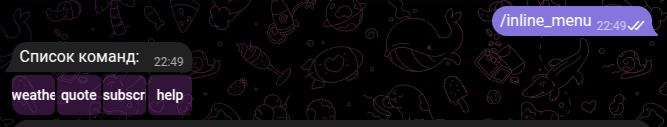

# About bot 🤖
🤖 Assistant bot that displays motivational quotes 🌟 or weather information ☁️ in the city. You can subscribe to a sending quotes 📜 or weather messages 🌦️. OpenWeatherMap API 🌍 and AI Giga Chat API 🧠 are used.
# How launch bot 🚀
0. `cd` in root project

1. [Create virtual environment](https://docs.python.org/3/library/venv.html#creating-virtual-environments)
```
python -m venv .venv
```

2. [Activate virtual environment](https://docs.python.org/3/library/venv.html#how-venvs-work)
  ```
  source .venv/bin/activate
```

3. Install python package
```
pip install -r ./requirements.txt
```

4. Get [telegram bot token](https://core.telegram.org/bots/features#botfather) and API key for [OpenWeather](https://openweathermap.org/api) and [GigaChat API](https://developers.sber.ru/portal/products/gigachat-api)

5. Run a bot whose API keys are specified as a command line argument
```commandline
python main.py --tg_bot_key TG_BOT_TOKEN --weather_api_key WEATHER_API_KEY --ai_api_key GIGACHAT_API
```

# Screenshots 🖼️
### `/start` command:


### `/help` command:


### `/inline_menu` command:


### `/quote` command:


### `/wheather cityArg` command:


### `/wheather` command:


### `/subscribe ` command:

